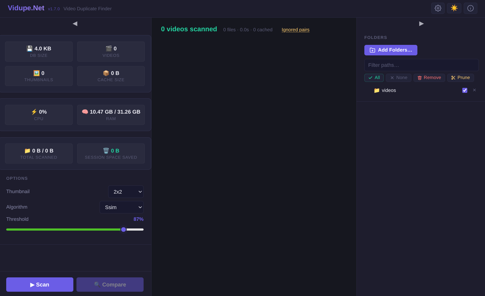

# VidupeDotNet


[](https://hub.docker.com/r/gafda/vidupe-net)



**VidupeDotNet** is a modern, high-performance video deduplication utility built on .NET 10 and Blazor Server. It identifies duplicate or near-duplicate video files using 7 comparison algorithms — CLIP, LPIPS, SSIM, pHash, dHash, Histogram, and MSE — with optional GPU acceleration.

> 📦 **Docker image available on Docker Hub:** [hub.docker.com/r/gafda/vidupe-net](https://hub.docker.com/r/gafda/vidupe-net)

---

## Features

- **7 Comparison Algorithms:** CLIP (semantic), LPIPS (deep perceptual), SSIM, pHash, dHash, Histogram, MSE — ordered by accuracy. Custom mode combines any algorithms. GPU-recommended warning for neural-network algorithms.
- **GPU Acceleration:** Optional CUDA/OpenCL acceleration with automatic CPU fallback.
- **Selective Folder Scanning:** Catalog all folders but scan/compare only those you check. Uncheck folders to exclude them without removing them.
- **Collapsible Folder Tree:** Folder paths are presented as a path-compressed tree with tri-state parent checkboxes, tree connector lines, and aggregate video counts.
- **Dark & Light Themes:** Toggle between dark and light modes with persistent preference.
- **High Performance:** Multi-core async processing for fast scanning of large libraries.
- **Deep Scanning:** Configurable frame capture positions (1×1 through 4×4 grids, cut-ends mode, others) for thorough visual comparison.
- **Mirrored Video Detection:** Detects horizontally flipped duplicates (e.g. front-camera recordings).
- **Video Summary Pre-filter:** Optional majority-vote pHash per video for O(1) pair rejection, reducing comparison time and RAM for large collections.
- **Lossless WebP Thumbnails:** Captured frames are stored as lossless WebP for 100% faithful pixel reproduction.
- **Retry Failed Scans:** One-click retry for all files that failed during scanning.
- **Re-compare Warnings:** Alerts when comparison data may be stale after a new scan, with optional suppression.
- **Pair Estimate:** Live estimate of comparison pair count and thumbnail size in the sidebar.
- **Incomplete Thumbnail Rescan:** Videos with missing captures are automatically re-scanned.
- **Persistent State:** Scan data, ignored pairs, and failed scan history are preserved across sessions.
- **Docker Ready:** Pre-built images for both x64 and ARM64 (Raspberry Pi 4/5) with optional GPU passthrough.
- **Connection Resilience:** Automatic reconnection with user notification when the server disconnects.

---

## Getting Started with Docker

The recommended way to run VidupeDotNet is via the pre-built Docker image on [Docker Hub](https://hub.docker.com/r/gafda/vidupe-net).

### Prerequisites

- [Docker](https://docs.docker.com/get-docker/) or [Podman](https://podman.io/getting-started/installation)
- FFmpeg is bundled in the image — no separate installation needed
- Optional: NVIDIA GPU + drivers on the host for GPU-accelerated algorithms (pHash, SSIM)
- Optional: CUDA Toolkit 12.x + cuDNN 9.x on the host for neural-network GPU acceleration (CLIP, LPIPS) — see [GPU Setup](#gpu-setup)

### Quick Start

```bash
docker run -d \
  --name vidupe-net \
  -p 8080:8080 \
  -v /path/to/your/videos:/videos:ro \
  -v vidupe-data:/data \
  gafda/vidupe-net:latest
```

Then open your browser at `http://localhost:8080`.

> ⚠️ **Read-only volume warning:** The `:ro` flag mounts your video folder as **read-only**. This prevents VidupeDotNet from deleting or renaming any files on disk. If you want to allow in-app deletion or renaming of video files, remove the `:ro` flag:
>
> ```bash
> -v /path/to/your/videos:/videos
> ```
>
> Only do this if you intend to allow the application to modify your files directly.

### Available Tags

| Tag | Architecture | Description |
|-----|-------------|-------------|
| `latest` | x64 | Latest stable release |
| `1.7.0` | x64 | Specific version |
| `1.7.0-arm64` | ARM64 | Raspberry Pi 4/5 and other ARM64 devices |

---

## Volume Configuration

| Volume | Container Path | Purpose |
|--------|---------------|---------|
| Your video library | `/videos` | The folder VidupeDotNet will scan |
| Persistent data | `/data` | Database, cache, and app state |

You can mount multiple video subfolders if needed:

```bash
docker run -d \
  --name vidupe-net \
  -p 8080:8080 \
  -v /mnt/nas/movies:/videos/movies:ro \
  -v /mnt/nas/series:/videos/series:ro \
  -v vidupe-data:/data \
  gafda/vidupe-net:latest
```

> ⚠️ **Read-only volume warning:** All volumes above use `:ro` (read-only). File deletion and renaming from within the app will be blocked. Remove `:ro` on any mount where you want to allow modifications.

---

## GPU Setup

VidupeDotNet has two independent GPU acceleration paths. Both are optional — the app always falls back to CPU gracefully.

| Mode | Algorithms | Host Requirement |
|------|-----------|-----------------|
| **CUDA/OpenCL** | pHash, SSIM | NVIDIA/AMD GPU + drivers |
| **ONNX CUDA** | CLIP, LPIPS | NVIDIA GPU + CUDA Toolkit 12.x + cuDNN 9.x |

The NVIDIA driver alone is **not sufficient** for ONNX CUDA acceleration. You must also install the CUDA Toolkit libraries on the **host machine**:

```bash
# Fedora / RHEL / Bazzite
sudo dnf install cuda-cudart-12-6 libcublas-12-6 libcufft-12-6 libcurand-12-6 libcusparse-12-6 libcudnn9-cuda-12

# Ubuntu / Debian
sudo apt install cuda-toolkit-12-6 libcudnn9-cuda-12
```

If CUDA libraries are missing, CLIP and LPIPS will fall back to CPU automatically with a warning in the logs.

---

## GPU Passthrough

The container image is GPU-agnostic — GPU drivers are injected at runtime by the host.

| GPU Vendor | Docker flag | Podman flag |
|------------|-------------|-------------|
| **NVIDIA** | `--gpus all` | `--device nvidia.com/gpu=all` (CDI) |
| **AMD** | `--device /dev/kfd --device /dev/dri` | `--device /dev/kfd --device /dev/dri` |
| **Intel** | `--device /dev/dri` | `--device /dev/dri` |

### NVIDIA (Docker)

```bash
docker run -d \
  --name vidupe-net \
  -p 8080:8080 \
  --gpus all \
  -v /path/to/your/videos:/videos:ro \
  -v vidupe-data:/data \
  gafda/vidupe-net:latest
```

### NVIDIA (Podman, CDI)

```bash
podman run -d \
  --name vidupe-net \
  -p 8080:8080 \
  --device nvidia.com/gpu=all \
  -v /path/to/your/videos:/videos:ro \
  -v vidupe-data:/data \
  gafda/vidupe-net:latest
```

### AMD (Docker or Podman)

```bash
docker run -d \
  --name vidupe-net \
  -p 8080:8080 \
  --device /dev/kfd --device /dev/dri \
  -v /path/to/your/videos:/videos:ro \
  -v vidupe-data:/data \
  gafda/vidupe-net:latest
```

### Intel (Docker or Podman)

```bash
docker run -d \
  --name vidupe-net \
  -p 8080:8080 \
  --device /dev/dri \
  -v /path/to/your/videos:/videos:ro \
  -v vidupe-data:/data \
  gafda/vidupe-net:latest
```

> ⚠️ **Read-only volume warning:** All examples above use `:ro` on the video mount. To enable in-app file deletion or renaming, remove the `:ro` suffix from the `-v` flag for your video folder.

---

## Docker Compose

A minimal `docker-compose.yml` for CPU-only usage:

```yaml
services:
  vidupe-net:
    image: gafda/vidupe-net:latest
    container_name: vidupe-net
    ports:
      - "8080:8080"
    volumes:
      - /path/to/your/videos:/videos:ro   # Remove :ro to allow file deletion/renaming
      - vidupe-data:/data
    restart: unless-stopped

volumes:
  vidupe-data:
```

For GPU passthrough, add the appropriate device or deploy section for your vendor. See the [GPU Passthrough](#gpu-passthrough) section above.

---

## ARM64 (Raspberry Pi 4/5)

Pull and run the ARM64 image directly:

```bash
docker run -d \
  --name vidupe-net \
  -p 8080:8080 \
  -v /path/to/your/videos:/videos:ro \
  -v vidupe-data:/data \
  gafda/vidupe-net:1.7.0-arm64
```

> Note: Neural-network algorithms (CLIP, LPIPS) will run on CPU on ARM64 as ONNX CUDA is not supported on this architecture.

---

## How it Works

1. **Discover** — Recursively scan video files across your selected folders.
2. **Extract Metadata** — Read duration, resolution, codec, and bitrate from each file.
3. **Capture Frames** — Sample frames at configurable positions throughout each video.
4. **Compare** — Run the selected algorithms to score visual similarity between video pairs.
5. **Review** — Side-by-side comparison UI with one-click delete, swap, or ignore.

---

## Origin & Credits

> **VidupeDotNet** is an independent implementation inspired by the original [vidupe](https://github.com/kristiankoskimaki/vidupe) created by **Kristian Koskimaki**.
>
> While this is a completely separate codebase, it honors the legacy of the original tool by continuing its mission to provide a powerful, open-source solution for video library management.

---

## License

Distributed under the **GPL v3.0 License**. See `LICENSE` for details.
