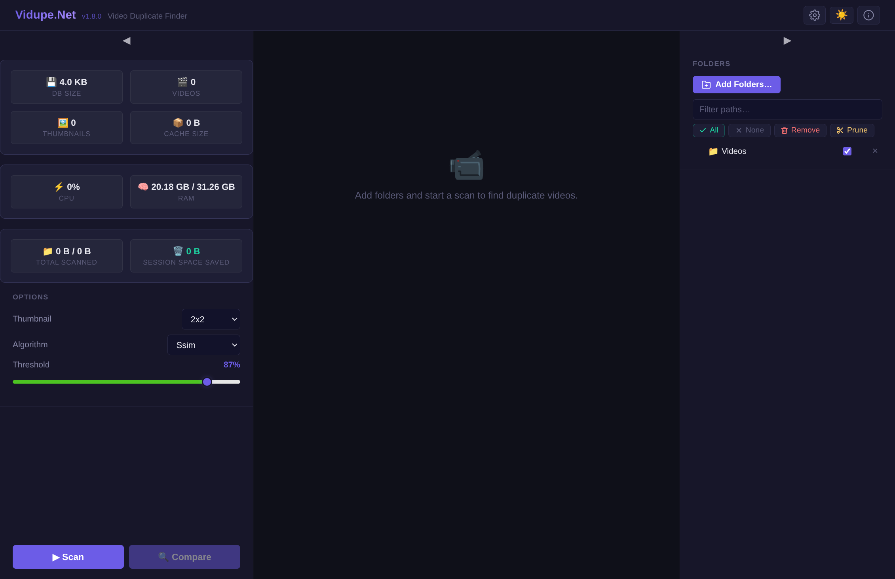
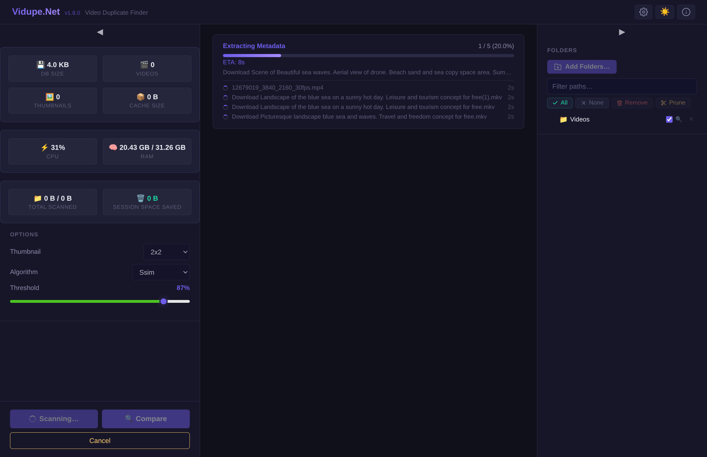
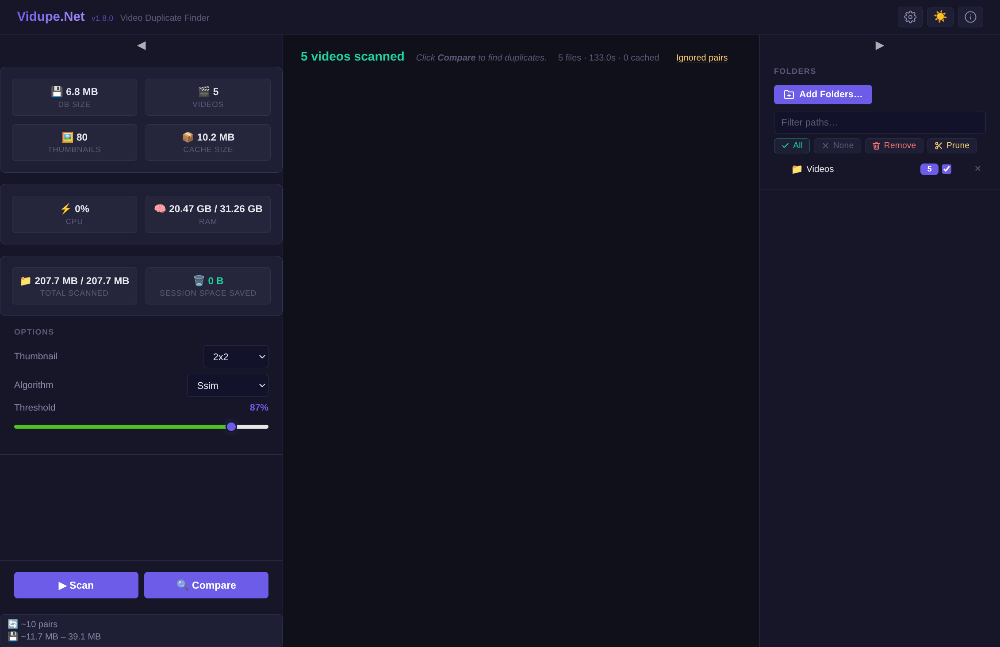
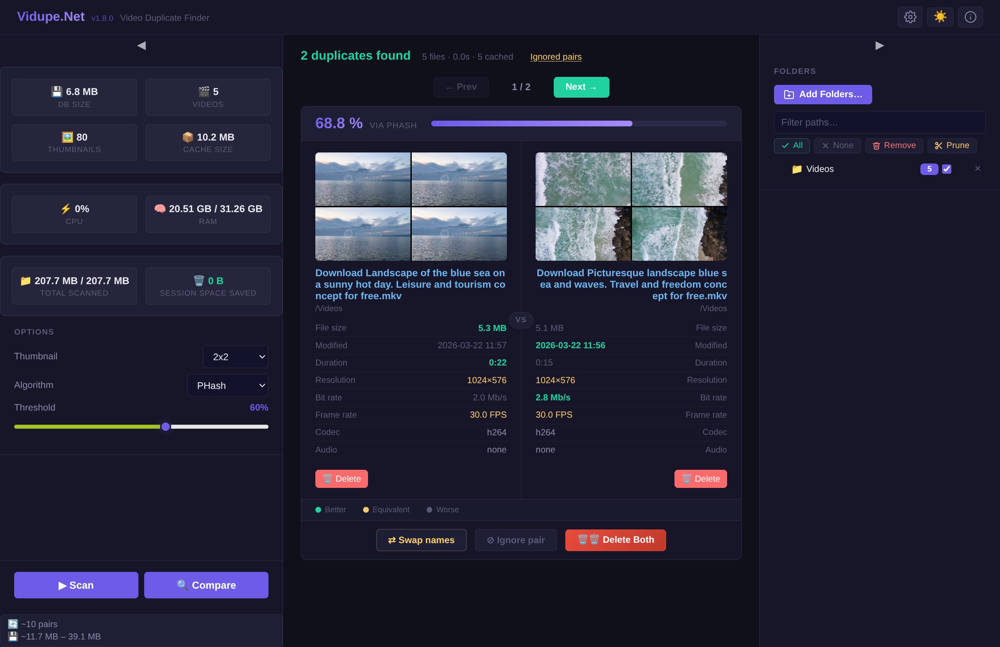
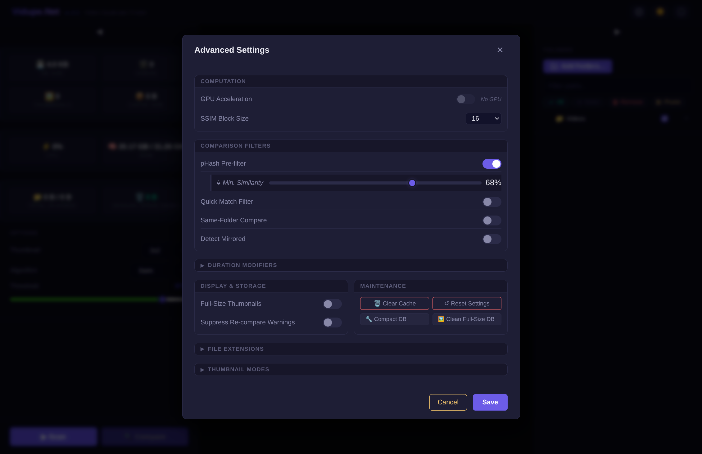
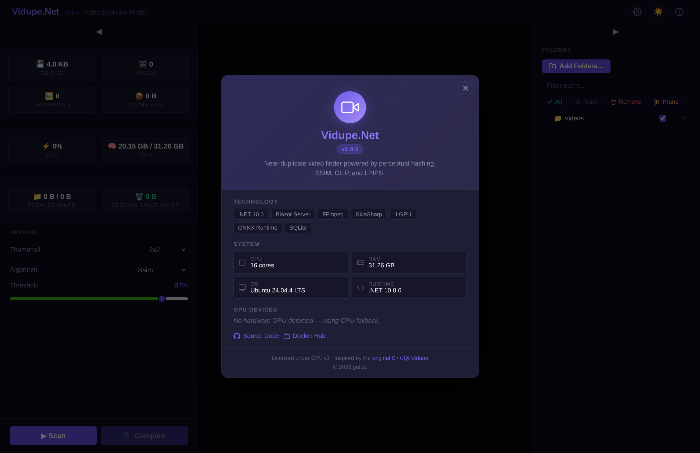

# VidupeDotNet — Quick Start Guide

**VidupeDotNet** finds near-duplicate video files. Open it in a browser, scan your library, review matches, and delete what you don't need.

---

## The Workflow at a Glance

```
Add Folders → Scan → Compare → Review & Delete
```

---

## Step 1 — Add Folders



Click **Add Folders…** in the top-right panel to open the folder browser and pick one or more directories.

Each folder appears in the tree with a **checkbox** next to it. Only checked folders are included in the next scan and comparison.

- **All** — check every folder at once
- **None** — uncheck all
- **Remove** — permanently remove a folder from the list
- **Prune** — remove folders that no longer exist on disk

---

## Step 2 — Configure Options (Left Sidebar)

Before scanning, set your options in the **OPTIONS** section of the left sidebar:

| Option | What it does |
|--------|-------------|
| **Thumbnail** | Frame capture grid — `1x1` (1 frame) to `4x4` (16 frames). More frames = more accurate but slower. |
| **Algorithm** | Similarity algorithm used for comparison (see table below). |
| **Threshold** | Minimum similarity score (%) for a pair to be reported as a duplicate. |

### Algorithms (ordered by accuracy)

| Algorithm | Type | GPU benefit |
|-----------|------|------------|
| CLIP | Semantic (neural network) | Recommended |
| LPIPS | Deep perceptual (neural network) | Recommended |
| SSIM | Structural similarity | Yes |
| pHash | Perceptual hash | Yes |
| dHash | Difference hash | Minimal |
| Histogram | Colour histogram | No |
| MSE | Mean squared error | No |

> Use **SSIM** or **pHash** as a good default. Use **CLIP** or **LPIPS** for the most accurate results when a GPU is available.

---

## Step 3 — Scan



Click **▶ Scan**. The app will:

1. Discover all video files in checked folders
2. Extract metadata (duration, resolution, codec, bitrate)
3. Capture frames and store lossless WebP thumbnails

A progress bar shows the current phase, file count, and ETA. Click **Cancel** to stop early. Already-scanned files are cached and skipped on subsequent scans.

---

## Step 4 — Review Scan Results



When the scan completes, the header shows a summary: *"5 videos scanned · 5 files · 133.0s · 0 cached"*.

The left sidebar updates with live stats:

| Stat | Meaning |
|------|---------|
| **DB Size** | SQLite database size on disk |
| **Videos** | Total cached videos |
| **Thumbnails** | Captured frames stored |
| **Cache Size** | Thumbnail storage used |
| **Total Scanned** | Cumulative data volume processed |

At the bottom of the sidebar, a **pair estimate** shows the approximate number of pairs to compare and the expected thumbnail memory range.

---

## Step 5 — Compare

Click **◉ Compare**. The app scores all video pairs using the selected algorithm and threshold, then presents the results.

---

## Step 6 — Review Duplicates



Each result card shows:

- **Similarity score** and the algorithm used (e.g. *68.8% via PHash*)
- Side-by-side **thumbnail grids** for both videos
- A **metadata table** comparing file size, duration, resolution, bitrate, frame rate, codec, and audio
- Highlighted cells in **blue** indicate the better value for each attribute

### Actions

| Button | What it does |
|--------|-------------|
| **Delete** (per video) | Send that file to the system trash |
| **Swap names** | Exchange the filenames of the two videos |
| **Ignore pair** | Dismiss this pair — it won't reappear |
| **Delete Both** | Send both files to the system trash |

Use **← Prev** / **Next →** to navigate between duplicate pairs.

> The legend at the bottom of the card uses colour to indicate which video is **Better**, **Equivalent**, or **Worse** for each attribute.

---

## Advanced Settings



Open the **⚙ Settings** dialog from the top-right header icon.

### Computation

| Setting | Description |
|---------|-------------|
| **GPU Acceleration** | Toggle CUDA/OpenCL for supported algorithms. Disabled automatically when no hardware GPU is detected. |
| **SSIM Block Size** | Tile size for SSIM computation (8, 16, 32). Smaller = more accurate, slower. |

### Comparison Filters

| Setting | Description |
|---------|-------------|
| **pHash Pre-filter** | Fast O(1) rejection of dissimilar pairs before the main algorithm runs. Tune the **Min. Similarity** slider to trade thoroughness for speed. |
| **Quick Match Filter** | Apply the algorithm threshold during comparison rather than at display time, reducing memory usage. |
| **Same-Folder Compare** | Only compare videos within the same configured folder. |
| **Detect Mirrored** | Detect horizontally flipped duplicates (e.g. front-camera re-uploads). |

### Duration Modifiers

Expand this section to configure how duration differences affect matching (e.g. to tolerate trimmed or re-encoded versions).

### Display & Storage

| Setting | Description |
|---------|-------------|
| **Full-Size Thumbnails** | Load original-resolution frames instead of preview-size crops when reviewing pairs. |
| **Suppress Re-compare Warnings** | Silence the alert shown after a new scan when existing comparison data may be stale. |

### Maintenance

| Button | Description |
|--------|-------------|
| **Clear Cache** | Delete all stored thumbnails and hashes (requires a full rescan). |
| **Reset Settings** | Restore all settings to their defaults. |
| **Compact DB** | Run SQLite `VACUUM` to reclaim disk space. |
| **Clean Full-Size DB** | Remove full-size thumbnail cache entries. |

---

## About



Click the **ⓘ** icon in the top-right corner to open the About dialog. It shows:

- Current version
- Technology stack (.NET 10, Blazor Server, FFmpeg, SkiaSharp, ILGPU, ONNX Runtime, SQLite)
- System information (CPU cores, RAM, OS, .NET runtime)
- GPU devices detected (or "No hardware GPU detected — using CPU fallback")
- Links to Source Code and Docker Hub
